# 📚 EpicReads — Serverless Lead Capture on AWS

 

[](https://d9r3iicczsww3.cloudfront.net/)

[](https://aws.amazon.com/)

 

> A production-ready, fully serverless lead capture system built on AWS. Users visit the landing page, submit their details, and instantly receive a free ebook download — while their information is securely stored in DynamoDB and a notification email is sent to the business owner via Amazon SES.

 

🔗 **Live Demo:** https://d9r3iicczsww3.cloudfront.net/

 

---

 

## 🏗️ Architecture

 



 

## ☁️ AWS Services Used

 

| Service | Purpose |

|---------|---------|

| Amazon CloudFront | Global CDN + HTTPS |

| Amazon S3 | Static website hosting |

| Amazon API Gateway | REST API endpoint |

| AWS Lambda | Serverless business logic |

| Amazon DynamoDB | Lead storage |

| Amazon SES | Email notifications |

| Amazon CloudWatch | Logs and monitoring |

| AWS IAM | Roles and least privilege |

 

---

 

## 🔄 How It Works

 

1. User visits the landing page served via **CloudFront → S3**

2. User fills in name and email and clicks **"Download ebook"**

3. **API Gateway** receives the POST request

4. **AWS Lambda** processes the request:

   - Saves lead to **DynamoDB**

   - Sends email notification via **Amazon SES**

5. PDF downloads automatically on the user's device

6. Green success message shown inline on the page

 

---

 

## ✅ Features

 

- Fully serverless — no servers to manage

- Global CDN via CloudFront

- Automatic PDF download on form submit

- Lead storage in DynamoDB

- Email notification for every new lead

- Two-layer input validation (frontend JS + backend Lambda)

- Loading state on submit button

- Inline success/error feedback (no browser alerts)

- Environment variables — no hardcoded credentials

- CloudWatch logging on every Lambda execution

 

---

 

## 🔒 Security

 

| Feature | Implementation |

|---------|---------------|

| No hardcoded secrets | Lambda environment variables |

| Input validation | Frontend JS + Lambda double validation |

| Email format check | Regex on both layers |

| CORS policy | Configured on API Gateway |

| IAM least privilege | Custom role with only required permissions |

| HTTPS | Enforced via CloudFront |

 

---

 

## 🚀 Setup & Deployment

 

### Prerequisites

- AWS Account

- AWS CLI configured

- Node.js 18+

- Git

 

### Phase 1: Host Static Website

 

```bash

# Clone the repo

git clone https://github.com/Roselinjan/epicreads-serverless.git

cd epicreads-serverless

 

# Create S3 bucket

aws s3 mb s3://your-bucket-name

 

# Sync files

aws s3 sync . s3://your-bucket-name

```

 

- Enable static website hosting in S3 console

- Configure CloudFront distribution pointing to S3

 

### Phase 2: Backend Setup

 

1. Verify email in Amazon SES

2. Create IAM policy with SES + DynamoDB + CloudWatch permissions

3. Create IAM Role and attach policy

4. Create Lambda function with environment variables:

 

| Key | Value |

|-----|-------|

| `TABLE_NAME` | your-dynamodb-table |

| `MY_EMAIL` | your@email.com |

 

5. Create DynamoDB table:

```bash

aws dynamodb create-table \

  --table-name epicreads-users-v2 \

  --attribute-definitions AttributeName=email,AttributeType=S \

  --key-schema AttributeName=email,KeyType=HASH \

  --billing-mode PAY_PER_REQUEST \

  --region ap-south-1

```

 

6. Create API Gateway REST API with POST method and CORS enabled

7. Update `index.html` with your API Gateway URL

8. Sync and invalidate CloudFront cache

 

---

 

## 🔮 Future Improvements

 

- [ ] Google reCAPTCHA to prevent spam

- [ ] Email OTP verification

- [ ] CloudFront Origin Access Control (OAC)

- [ ] API Gateway rate limiting

- [ ] CloudWatch Dashboard with submission metrics

- [ ] Custom domain via Route 53

 

---

 

## 👩‍💻 Author

 

**RoselinJanice**

- GitHub: [@Roselinjan](https://github.com/Roselinjan)

- Live Demo: https://d9r3iicczsww3.cloudfront.net/
